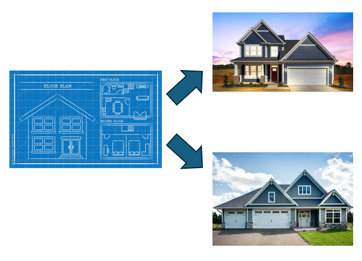

# Lab Assignment 16

In this lab you will practice working with classes and objects.

Unlike previous labs, your main class has already been created for you. 

## Let's get started!

For this lab your **main() method** is in the Dealership class. You can create any new classes below the Dealership class or inside a new java file. 

Now let's begin!

## Classes and Objects

Classes and objects are the core concept of Object-Oriented Programming (OOP). Classes are blueprints with instructions on how to build an object. A class itself is not a real entity, however an object is. Think of how architects use blueprints to build houses. Once built, houses are independent from each other.



### Attributes and Methods


**Attributes** are variables within an object storing data pertaining to that object. For example, look at the diagram above. Using the Dog class we can creat multiple objects representing an indivdual dogs, each with unique attributes such as `name` and `is_thirsty`.

**Methods** are functions within an object that perform an action for that object itself. For example, if we call the method `drink_water()` from dog1, it will only quench the thirst for dog1, thus dog2 and dog3 will remain thirsty.

* Classes also have **constructors**. Constructors are unique methods that don't have a type and are used to set default values to our attributes.

**Code Example:**

```java
public class Main {
    public static void main(String[] args) {
        // Creating objects from Dog class
        // Each object is independent from one another.
        Dog dog1 = new Dog("Rover");
        Dog dog2 = new Dog("Spot");
        Dog dog3 = new Dog("Sparky");
        
        // Quenching Rover's thirst only.
        dog2.drink_water();
    }
}

class Dog {
    // Attributes
    public String name;
    private boolean thirsty = true;

    // Methods
    public void drink_water() {
        thirsty = false;
    }
    Dog(String n) {
        name = n;
    }
}
```

## Your Program

### Car Dealership

Let's assume you  work at a Car Dealership.

Create a class `Car` with the **public** attributes `make`, `model`, and `year`.  Next, create a **constructor** with a three parameter to set the `make`, `model`, and `year`. Finally, create a **public** method `is_new()` to return `true` if the car is year 2024 or 2025, otherwise return `false`.

You can test your solution by running the commands below in your terminal.

```
./build.sh
./test.sh
```

## Submit your assignment

To submit your lab assignment click on the source control icon (3 circles with 2 lines) on your leftside navbar. Next, click on the '+' symbol next to "Changes" to stage your changes. Lastly, add a commit message (ex: "First commit") and click "Commit" then "Push" or "Sync Changes". And you're done!
